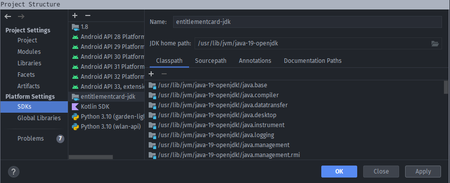

# Frontend

The Ehrenamtskarte app uses Flutter. You can have a look at [this guide](https://flutter.dev/docs/get-started/install) to install flutter and the tools needed to work with it. Alternatively, you can take a look at [README.md](../frontend/README.md) for a simpler guide which uses Flutter Version Manager.

This short guide focuses on setting up the project using IntelliJ instead of Android Studio:
1. Install [Dart SDK](https://dart.dev/get-dart)
   1.1. On Arch Linux you can just do: `pacman -S dart`
2. Install [Flutter](https://flutter.dev/docs/get-started/install/linux)
   2.1. You need write access to the flutter installation directory:
        ```
        chgrp -R flutterusers /opt/flutter
        chmod g+w /opt/flutter
        sudo usermod -a -G flutterusers $USER
        ```
3. Install Android SDK via [IntelliJ](https://www.jetbrains.com/help/idea/create-your-first-android-application.html#754fd) or Android Studio
4. Open the root project in IntelliJ
   4.1. Install the Android extension in IntelliJ and set the SDK path in the settings of IntelliJ
   4.1. Install the Dart extension in IntelliJ and set the SDK path in the settings of IntelliJ
   4.2. Install the Flutter extension in IntelliJ and set the SDK path in the settings of IntelliJ
5. Run `flutter pub get` in `frontend/`
6. Execute the "Run Flutter" (upper right corner of IDE) configuration from within IntelliJ

# Backend

1. Install docker and docker-compose
2. `sudo docker-compose rm`
3. `sudo docker-compose build`
4. `sudo docker-compose up --force-recreate`
5. Open Adminer: [http://localhost:5001](http://127.0.0.1:5001/?pgsql=db-postgis&username=postgres&db=ehrenamtskarte)
   The credentials are:
   |Property|Value|
   |---|---|
   |Host (within Docker)|db-postgis|
   |Username|postgres|
   |Password|postgres|
   |Database|ehrenamtskarte|
6. Install at least JDK 17 LTS
7. Open the IntelliJ "Project Structure" and setup the required SDK called "entitlementcard-jdk" and point it to your JDK installation.
   
8. Run the backend: `cd backend && ./gradlew run --args="execute"` or `.\backend\gradlew.bat run --args="execute"` on Windows
9. Create an admin account using `./gradlew run --args="create-admin <email> <password>"`
10. Take a look at the martin endpoints: [http://localhost:5002/tiles/accepting_stores/index.json](http://localhost:5002/tiles/accepting_stores/index.json) and [http://localhost:5002/tiles/accepting_stores/rpc/index.json](http://localhost:5002/tiles/accepting_stores/rpc/index.json). The data shown on the map is fetched from a hardcoded url and is not using the data from the local martin!
11. Take a look at the style by viewing the test map: [http://localhost:5002](http://localhost:5002)
12. Take a look at the backend: [http://localhost:7000](http://localhost:7000) (The public version is available at
    api.entitlementcard.app)

## Dumping and restoring the database through docker

```bash
docker exec -ti <container_id> pg_dump -c -U postgres ehrenamtskarte > dump-$(date +%F).sql
```

To copy the dump to your local machine:

```bash
rsync root@ehrenamtskarte.app:dump-2020-12-23.sql .
```

To restore the dump
```bash
docker exec -i <container_id> psql ehrenamtskarte postgres < dump-$(date +%F).sql
```


## Using ehrenamtskarte.app as database

```bash
ssh -L 5432:localhost:5432 -L 5001:localhost:5001 team@ehrenamtskarte.app
```

That way the Adminer and postgres will be available locally.

